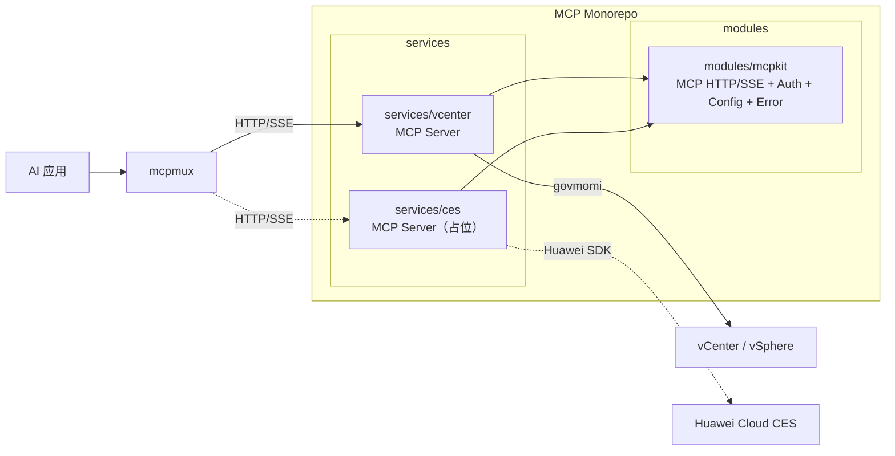

# 2026-04-16-00 Overall Component UML

## 组件图

```mermaid
graph LR
  ai["AI 应用"] --> mux["mcpmux"]

  subgraph monorepo["MCP Monorepo"]
    subgraph svc["services"]
      vcenter["services/vcenter\nMCP Server"]
      ces["services/ces\nMCP Server（占位）"]
    end

    subgraph shared["modules"]
      mcpkit["modules/mcpkit\nMCP HTTP/SSE + Auth + Config + Error"]
    end

    vcenter --> mcpkit
    ces --> mcpkit
  end

  mux -->|"HTTP/SSE"| vcenter
  mux -.->|"HTTP/SSE"| ces

  vcenter -->|"govmomi"| vcapi["vCenter / vSphere"]
  ces -.->|"Huawei SDK"| cesapi["Huawei Cloud CES"]
```
