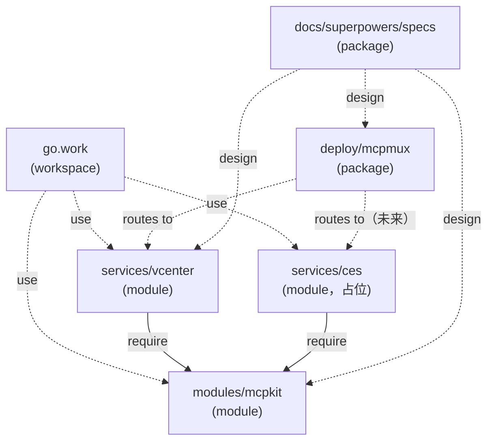

# 2026-04-16-00 Overall Package UML

## 包图（go.work + 多 go.mod）

```mermaid
graph TD
  gowork["go.work\n(workspace)"]

  mcpkit["modules/mcpkit\n(module)"]
  vcenter["services/vcenter\n(module)"]
  ces["services/ces\n(module，占位)"]

  deploymux["deploy/mcpmux\n(package)"]
  specs["docs/superpowers/specs\n(package)"]

  gowork -.->|"use"| mcpkit
  gowork -.->|"use"| vcenter
  gowork -.->|"use"| ces

  vcenter -->|"require"| mcpkit
  ces -->|"require"| mcpkit

  deploymux -.->|"routes to"| vcenter
  deploymux -.->|"routes to（未来）"| ces

  specs -.->|"design"| mcpkit
  specs -.->|"design"| vcenter
  specs -.->|"design"| deploymux
```
