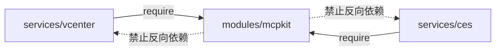

# 2026-04-16-01 Monorepo Workspace Design

## 目标

在单一 Monorepo 中管理多个独立的 MCP Server（HTTP/SSE），并通过外部 `mcpmux` 网关统一接入。仓库采用 Go `go.work` 工作区形态，服务与共享库均为独立 Go Module，确保依赖隔离与独立发布能力。

一期范围：

- 交付 `vcenter` MCP 服务（MVP）
- `ces` 仅提供模块脚手架占位
- 提供 `mcpmux` docker-compose 接入示例（不实现 `mcpmux` 本体）

非目标：

- 不在本仓库实现 `mcpmux`
- 不在一期交付 CES/AOM/APM 具体能力

## Go 版本基线

- Go 版本：1.22
- CI 与本地开发统一使用 `go1.22.x`

## 仓库目录约定

```
.
├── go.work
├── modules/
│   └── mcpkit/                # 共享基础库（独立 go.mod）
├── services/
│   ├── vcenter/               # vCenter MCP Server（独立 go.mod）
│   └── ces/                   # Huawei Cloud CES MCP Server（占位，独立 go.mod）
├── deploy/
│   └── mcpmux/                # docker-compose 示例与接入说明
└── docs/
    └── superpowers/
        └── specs/
```

```mermaid
flowchart TB
  repo[Monorepo]
  work[go.work]

  subgraph modules[modules]
    mcpkit[modules/mcpkit<br/>共享基础库]
  end

  subgraph services[services]
    vcenter[services/vcenter<br/>vCenter MCP Server]
    ces[services/ces<br/>CES MCP Server(占位)]
  end

  subgraph deploy[deploy]
    mux[deploy/mcpmux<br/>docker-compose 示例]
  end

  repo --> work
  repo --> modules
  repo --> services
  repo --> deploy
  vcenter --> mcpkit
  ces --> mcpkit
  mux --> vcenter
```

## Module 命名约定

仓库 module path 以 `github.com/<org>/<repo>` 为根（后续替换为真实值）。

- `modules/mcpkit`：`github.com/<org>/<repo>/modules/mcpkit`
- `services/vcenter`：`github.com/<org>/<repo>/services/vcenter`
- `services/ces`：`github.com/<org>/<repo>/services/ces`

## go.work 约定

`go.work` 作为 monorepo 入口，将所有模块加入工作区。示例：

```txt
go 1.22

use (
  ./modules/mcpkit
  ./services/vcenter
  ./services/ces
)
```

原则：

- 服务模块对共享库的依赖通过正常 `require` 引入；在 workspace 内由本地 `use` 解析到源代码
- 共享库对服务模块不得反向依赖



## 依赖策略

- 每个服务可以拥有自身依赖版本；跨服务共享逻辑只进入 `modules/mcpkit`
- `modules/mcpkit` 的外部依赖保持克制，优先使用标准库；需要引入时必须确保不会将服务的重依赖“倒灌”进共享库
- 服务若需要特定厂商 SDK（如 `govmomi`），放在对应服务模块内

## 共享与隔离边界

### modules/mcpkit 应包含

- MCP HTTP/SSE transport 与路由装配
- 认证中间件（Bearer token）
- 配置读取（环境变量）
- 通用错误映射与响应结构
- 健康检查、优雅退出、超时等 HTTP 基础能力

### services/* 应包含

- 与具体平台/云厂商相关的 SDK 依赖与封装
- MCP tools 的定义、参数校验、业务逻辑
- 资源模型（vSphere inventory、指标查询等）

## 构建与运行约定

- 每个服务模块自带 `cmd/<service>` 作为可执行入口（例如 `services/vcenter/cmd/vcenter-mcp-server`）
- 服务运行模式：HTTP/SSE（端口可配置）
- 统一健康检查端点：`/healthz`、`/readyz`

## 版本与发布约定（建议）

在一期阶段不引入复杂的多模块发布流水线，推荐策略：

- 服务模块与 `modules/mcpkit` 在同仓库内演进，发布时以“服务模块版本”为主
- 若未来需要服务独立发布与共享库版本化：
  - `modules/mcpkit` 采用语义化版本并打 tag（例如 `modules/mcpkit/v0.1.0`）
  - 各服务模块在 `go.mod` 中固定依赖版本

## 文档拆分索引

- `2026-04-16-02-mcpkit-http-sse-design.md`
- `2026-04-16-03-authn-authz-design.md`
- `2026-04-16-04-vcenter-service-design.md`
- `2026-04-16-05-mcpmux-compose-integration-design.md`
- `2026-04-16-06-ces-service-skeleton-design.md`（可选）
