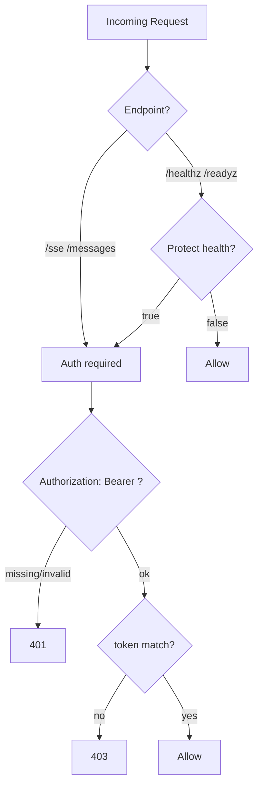
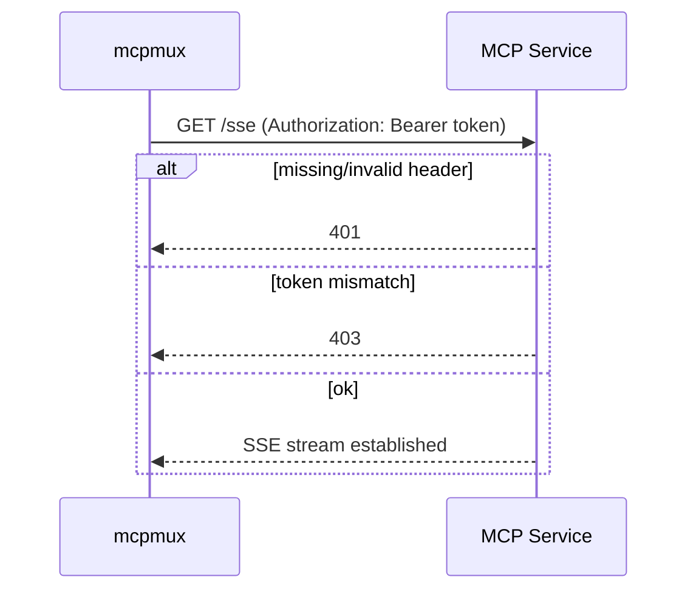

# 2026-04-16-03 AuthN/AuthZ Design

## 目标

为各 MCP HTTP/SSE 服务提供统一、简单、可部署的访问控制机制，确保 `mcpmux` 与服务之间的通信可鉴别与最小暴露。

一期采用静态 Token 方案：

- 客户端（`mcpmux`）以 `Authorization: Bearer <token>` 方式携带
- 服务端从环境变量读取 token 并校验

## 范围

包含：

- 鉴权 token 的载入、校验、错误返回
- 哪些端点需要鉴权
- token 轮换与部署建议

不包含：

- OIDC/JWT、mTLS、Vault/KMS 拉取等增强方案（可后续迭代）

## 端点鉴权规则

默认规则：

- 必须鉴权：
  - `GET /sse`
  - `POST /messages`
- 默认不鉴权：
  - `GET /healthz`
  - `GET /readyz`

可选增强（后续实现阶段是否启用再定）：

- `MCP_AUTH_PROTECT_HEALTH=true/false`：对健康检查也鉴权

## Token 配置

环境变量：

- `MCP_SERVICE_TOKEN`：服务端用于校验的 token

约束：

- token 必须非空；若未配置则服务启动失败（避免误以“已保护”但实际无鉴权）
- token 不得出现在日志中

## Token 校验逻辑

- 从 `Authorization` 头解析 `Bearer <token>`
- 解析失败返回 401
- token 不匹配返回 403 或 401（推荐 403，避免提示“token 是否存在”）
- 比较建议使用常量时间比较（防止时序侧信道）

## 错误返回约定

以 MCP 标准错误封装返回（由 `modules/mcpkit` 统一处理）：

- 401：缺少/格式错误
- 403：token 不匹配

响应 message：

- 对外仅描述“unauthorized/forbidden”，不回显 token 片段

## 最小授权（AuthZ）与高危操作

一期不做细粒度 RBAC，仅通过“危险操作开关”实现最小授权：

- `VCENTER_ENABLE_DANGEROUS_OPS=false` 默认值为 false
- 未开启时，相关 tools 不注册或调用直接返回受控错误

高危操作定义与工具列表在服务设计文档中维护：

- `2026-04-16-04-vcenter-service-design.md`

## 轮换与部署建议

- token 由部署系统注入（docker-compose 通过 `.env` 或 secret；K8s 后续可用 Secret）
- 轮换策略：并行部署新 token（网关与服务一致）后滚动更新
- 生产建议：token 长度足够（例如 32+ bytes 随机串），避免可猜测字符串
