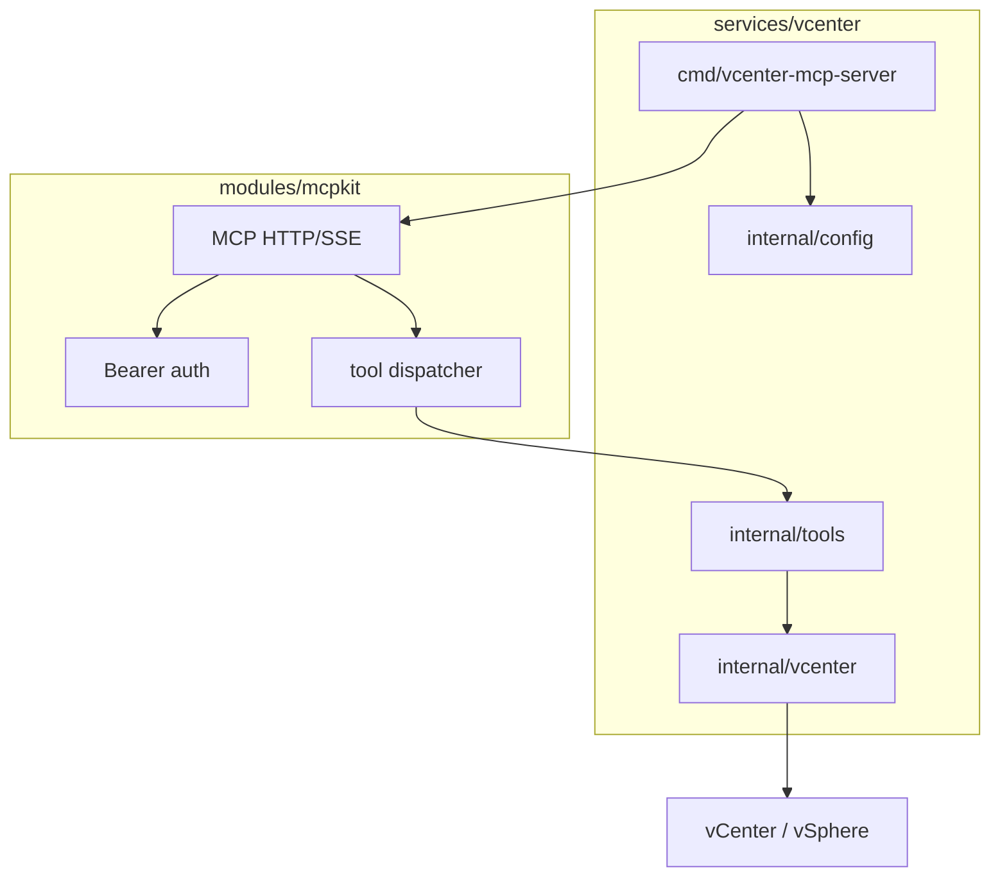
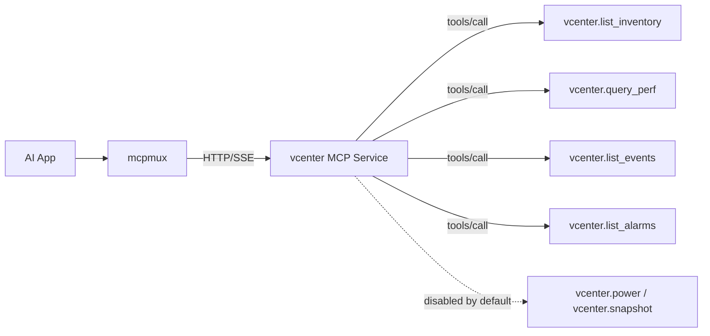
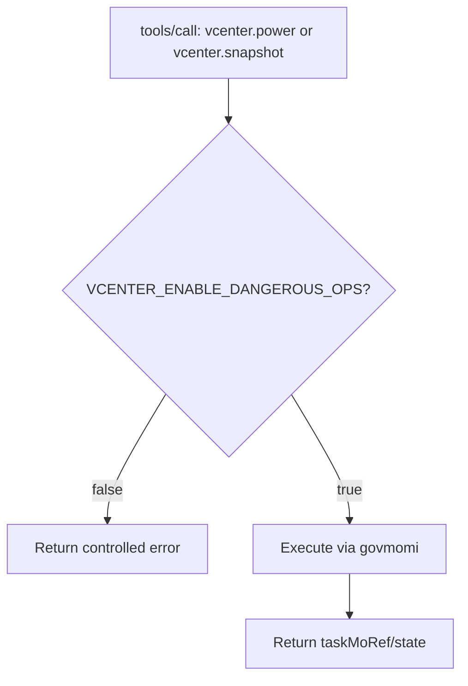

# 2026-04-16-04 vCenter Service Design

## 目标

交付 `services/vcenter` MCP Server，通过 MCP HTTP/SSE 暴露 vSphere / vCenter 的资产、性能、告警事件与受控运维能力，供 `mcpmux` 与 AI 应用调用。

一期（MVP）覆盖：

- 资产清单（Inventory）
- 性能指标（Performance）
- 告警与事件（Alarms / Events）
- VM 运维操作（Power / Snapshot），默认关闭，显式开启后可用

## 技术选型

- vSphere SDK：`govmomi`
- MCP 传输：`modules/mcpkit`（标准 HTTP/SSE）
- 鉴权：`Authorization: Bearer <token>`（见 `2026-04-16-03-authn-authz-design.md`）

## 模块布局（services/vcenter）

建议目录：

```
services/vcenter/
├── go.mod
├── cmd/
│   └── vcenter-mcp-server/
│       └── main.go
└── internal/
    ├── config/                # env 配置与校验
    ├── vcenter/               # govmomi client 封装、查询与操作
    └── tools/                 # MCP tools 定义与 handler
```



## 配置（环境变量）

### vCenter 连接

- `VCENTER_URL`：例如 `https://vcenter.example/sdk`
- `VCENTER_USERNAME`
- `VCENTER_PASSWORD`

### TLS

- `VCENTER_INSECURE`：默认 `false`
- `VCENTER_CA_FILE`：可选，提供自签 CA 的 PEM 文件路径

### 服务运行

- `HTTP_LISTEN_ADDR`：默认 `0.0.0.0:8080`
- `MCP_HTTP_BASE_PATH`：默认空（见 `mcpkit` 设计）
- `MCP_SERVICE_TOKEN`：鉴权 token

### 高危操作开关

- `VCENTER_ENABLE_DANGEROUS_OPS`：默认 `false`

## 连接管理

- 启动时创建 `govmomi.Client` 与必要的 Manager（如 `property.Collector`、`view.Manager`）
- 默认超时：为每个 tool 调用派生 context timeout（避免长时间挂起）
- 失败策略：
  - 鉴权失败：直接返回
  - vCenter 登录失败：tool 调用返回下游错误（可选在 `/readyz` 提前检测）

## Tool 设计

工具命名采用 `vcenter.<verb>_<object>` 风格，输入输出尽量 JSON 结构化，避免在 tool output 中返回超大原始对象。



### 资产清单

#### vcenter.list_inventory

用途：

- 列出指定类型资源的清单

输入（建议）：

- `types`: `["datacenter","cluster","host","datastore","network","vm"]`（至少一个）
- `nameContains`：可选
- `limit`、`cursor`：可选分页

输出（建议）：

- `items`: `{type, name, moRef, path, tags?}` 数组
- `nextCursor`: 可选

#### vcenter.get_vm

用途：

- 按 `moRef` 或路径定位 VM，并返回关键信息

输入（建议）：

- `moRef` 或 `path` 二选一

输出（建议）：

- `name`、`moRef`、`powerState`、`cpu`、`memoryMB`、`guest`（hostname/ip/guestId）等

实现要点：

- 使用 `property collector` 批量获取属性，减少往返

### 性能指标

#### vcenter.query_perf

用途：

- 查询对象（VM/Host/Cluster）的常用性能指标趋势或聚合值

输入（建议）：

- `objectType`: `vm|host|cluster`
- `moRef`
- `metrics`: 例如 `["cpu.usage","mem.usage","disk.iops","net.throughput"]`
- `startTime`、`endTime`（RFC3339）
- `intervalSeconds`：可选，聚合粒度

输出（建议）：

- `series`: `{metric, points:[{ts,value}]}` 数组

实现要点（govmomi）：

- 使用 `performance.Manager` 查询 counter 与 sample
- 对 counter 映射表做缓存（避免每次重建）

### 告警与事件

#### vcenter.list_events

用途：

- 拉取事件列表，支持时间范围与对象过滤

输入（建议）：

- `startTime`、`endTime`
- `moRef`：可选
- `types`：可选事件类型过滤
- `limit`、`cursor`

输出（建议）：

- `items`: `{ts, type, message, severity?, entityMoRef?}` 数组
- `nextCursor`

实现要点：

- 使用 `event.Manager` 查询；默认限制返回数量，避免一次输出过大

#### vcenter.list_alarms

用途：

- 列出告警定义与当前触发状态（先只读）

输入（建议）：

- `moRef`：可选，限定某对象

输出（建议）：

- `definitions` 与 `triggered` 分开返回，或统一为 `{alarmId, name, status, entityMoRef}` 列表

### VM 运维操作（高危）

默认禁用；当 `VCENTER_ENABLE_DANGEROUS_OPS=true` 时启用。



#### vcenter.power

输入（建议）：

- `vmMoRef`
- `action`: `on|off|reset|shutdown|reboot`（允许子集也可）

输出（建议）：

- `taskMoRef`、`state`

#### vcenter.snapshot

输入（建议）：

- `vmMoRef`
- `action`: `list|create|delete`
- `name`：create/delete 时使用
- `description`：create 可选

输出（建议）：

- list：`snapshots` 数组
- create/delete：`taskMoRef`、`state`

实现要点：

- 操作类 API 需返回 task 信息，并支持查询 task 状态（若一期不做 task poll，则在 output 中提示“任务已提交”）

## 安全与风险控制

- 默认关闭高危操作工具
- tool handler 必须做参数校验（moRef 格式、时间窗口、limit 上限）
- 返回数据脱敏：不返回用户名/密码/token，不返回潜在敏感字段（如 guest 的明文凭据）

## 测试与联调建议（实现计划阶段落地）

- vCenter client 封装层提供接口，便于使用 fake 实现做单元测试
- Tool 层做输入校验与错误映射单测
- 使用 docker-compose 启动服务并通过简单 MCP 客户端或 `mcpmux` 联调
