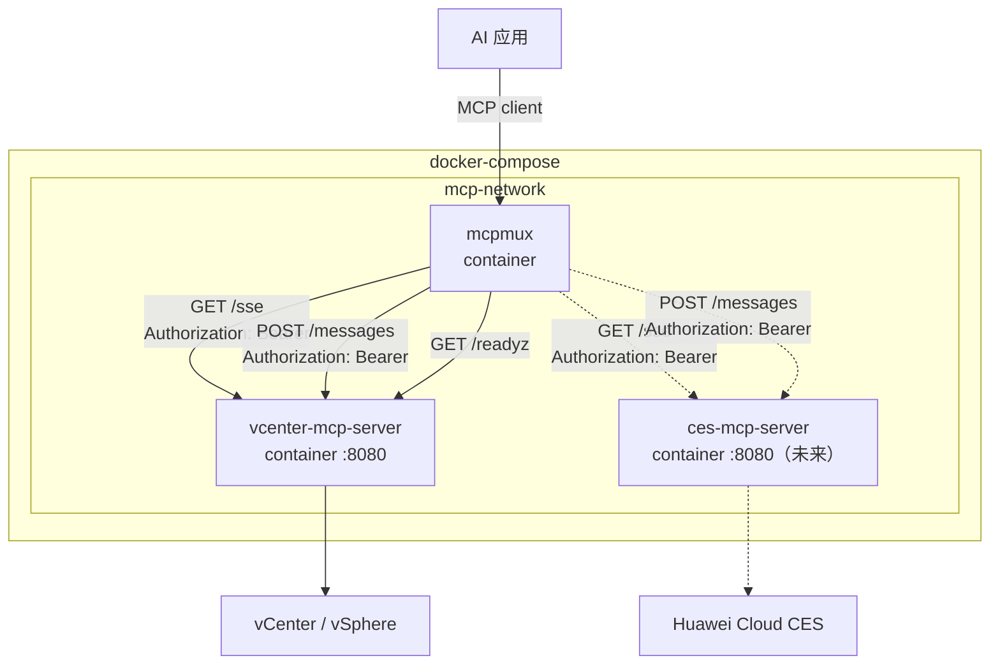

# Overall Deployment UML

```mermaid
graph TB
  subgraph docker["docker-compose"]
    subgraph net["mcp-network"]
      mux["mcpmux\ncontainer"]
      vcenter["vcenter-mcp-server\ncontainer :8080"]
      ces["ces-mcp-server\ncontainer :8080（未来）"]
    end
  end

  ai["AI 应用"] -->|"MCP client"| mux

  mux -->|"GET /sse\nAuthorization: Bearer"| vcenter
  mux -->|"POST /messages\nAuthorization: Bearer"| vcenter
  mux -->|"GET /readyz"| vcenter

  mux -.->|"GET /sse\nAuthorization: Bearer"| ces
  mux -.->|"POST /messages\nAuthorization: Bearer"| ces

  vcenter --> vc["vCenter / vSphere"]
  ces -.-> hces["Huawei Cloud CES"]
```
